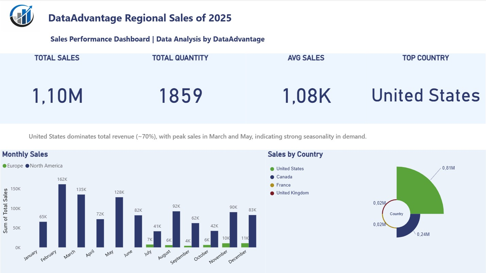

# 📊 Sales Dashboard (Power BI)

## 🔍 Overview
This project presents a Power BI dashboard analyzing regional sales performance.  
It highlights key metrics, trends, and business insights to support decision-making.

---

## 📈 Key Metrics
- Total Sales: 1.10M  
- Total Quantity: 1859  
- Average Sales: 1.08K  
- Top Country: United States  

---

## 💡 Key Insight
United States dominates total revenue (~70%), with peak sales in March and May, indicating strong seasonality in demand.

---

## 🛠 Tools Used
- Power BI  
- Data Modeling  
- DAX  

---

## 📸 Dashboard Preview

---

## 📁 Files
- `.pbix` file included for full interactive dashboard
